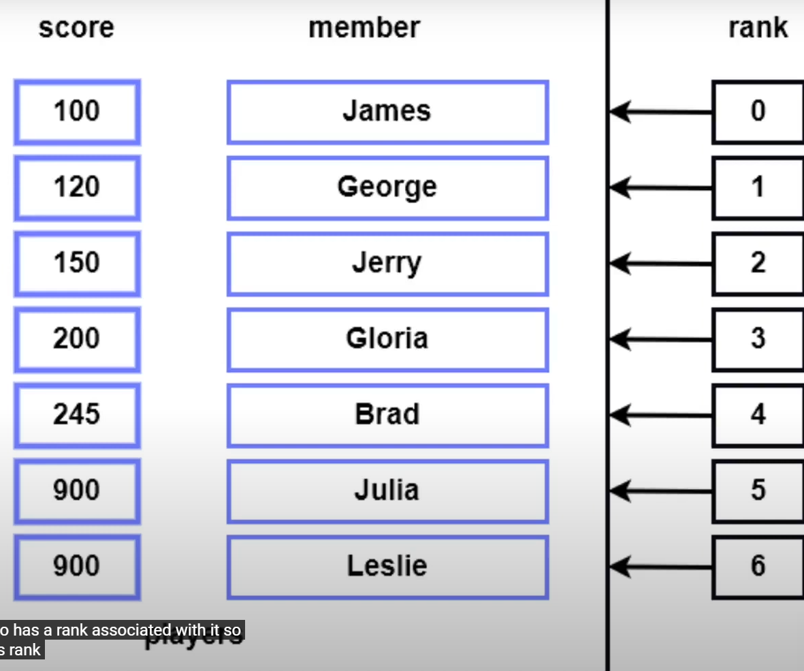
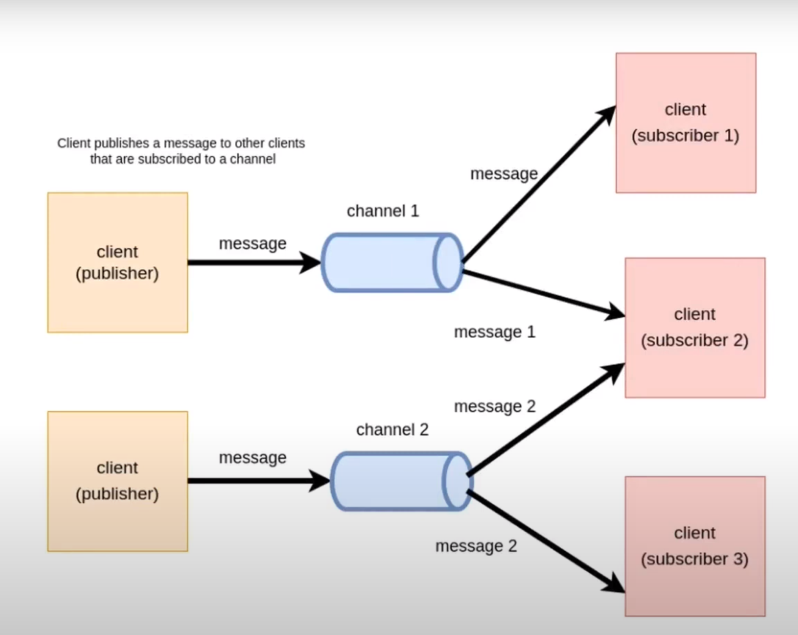
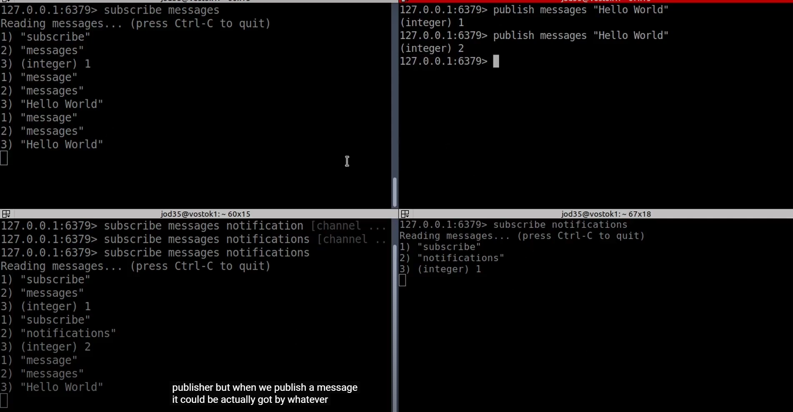
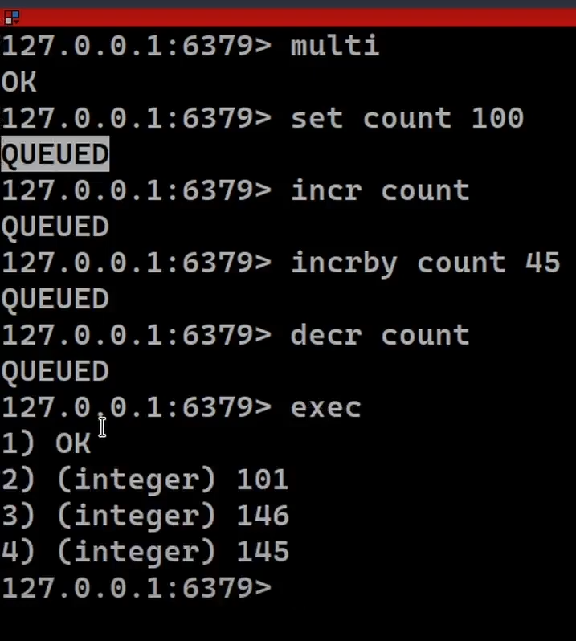

Learning redis from [Ssali Jonathan](https://youtu.be/9Tfs-RYrnYU?si=qNIhwpYG_fPZa4zy)

- Redis is basically an in-memory key value store
- Redis can be used as Database,a cache, a message broker and very many other things
- Let's start installing redis in Windows subsystem for linux (WSL) in windows powershell
- Currently i'm in WSL and set the distribution to `wsl --set-default ubuntu`
- open windows powershell - type `ubuntu` - gets you into wsl mode
- let's setup redis

```
abhimvp@Tinku:~$ sudo apt install redis-server
[sudo] password for abhimvp:
Reading package lists... Done
Building dependency tree... Done
Reading state information... Done
redis-server is already the newest version (6:7.4.1-1rl1~noble1).
redis-server set to manually installed.
0 upgraded, 0 newly installed, 0 to remove and 13 not upgraded.
```

- verify installation

```
redis-server
.
.
460:M 14 Oct 2024 23:07:29.362 * Server initialized
460:M 14 Oct 2024 23:07:29.377 * Ready to accept connections tcp
```

- we see that server is running good & to access the client we have to run the redis-cli command - let's open up new terminal tab & run the following commands

```
PS C:\Users\abhis> ubuntu
abhimvp@Tinku:~$ redis-cli
127.0.0.1:6379> ping
PONG
```

- this will go ahead and establish connections to port 6379 & we get POnG means server is established successfully
- Redis is short form of Remote Dictionary Server - what this does is store our data using keys and values at the basic level
- but it's not just a key value store & it can be used as database as well but difference between it and other DB's is that it stores data using data structures that it defines
- let's understand how redis works at low-level
  - Redis is a server meaning we have to make requests via our client & the connection between client and server occurs through the TCP protocol.
  - In our case the client is redis-cli & when establish this connection via TCP to our server , we can be able to write various commands to our server & be able to create read update and delete data in our server
- let's begin with basic hello world that we do in every technology , begin by using set command

```
127.0.0.1:6379> set message "Hello World"
OK
127.0.0.1:6379> get message
"Hello World"
```

- Above `message` is **key** and `"hello world"` is **value** we use **set** to attach the value to the **key** and we use **get** to retrive the value of **key**
- **Set multiple keys and values** using mset and mget command

```
127.0.0.1:6379> mset Uganda "kampala" Kenya "Nairobi" Rwanda "Kigali"
OK
```

Access values as follows

```
127.0.0.1:6379> mget Uganda Kenya Rwanda message
1) "kampala"
2) "Nairobi"
3) "Kigali"
4) "Hello World"
```

# Strings (basic data structure stored by redis) - data structure store

This data structure is the building block of other data structures

```
127.0.0.1:6379> set name jonathan
OK
127.0.0.1:6379> set age 23
OK
127.0.0.1:6379> set user "\"{'name':'Jonathan','age':23}\""
OK
127.0.0.1:6379> get name
"jonathan"
127.0.0.1:6379> get age
"23"
127.0.0.1:6379> get user
"\"{'name':'Jonathan','age':23}\""
127.0.0.1:6379> type name
string
127.0.0.1:6379> type age
string
127.0.0.1:6379> type user
string
```

Every data stored in redis is stored as a string value

```
127.0.0.1:6379>  strlen name
(integer) 8
127.0.0.1:6379> strlen age
(integer) 2
127.0.0.1:6379> strlen user
(integer) 30
127.0.0.1:6379> set votes 0
OK
127.0.0.1:6379> get votes
"0"
127.0.0.1:6379> incr votes
(integer) 1
127.0.0.1:6379> incr votes
(integer) 2
127.0.0.1:6379> incr votes
(integer) 3
127.0.0.1:6379> incr votes
(integer) 4
127.0.0.1:6379> decr votes
(integer) 3
127.0.0.1:6379> decr votes
(integer) 2
127.0.0.1:6379> decr votes
(integer) 1
127.0.0.1:6379> decr votes
(integer) 0
127.0.0.1:6379> incrby votes 100
(integer) 100
127.0.0.1:6379> type votes
string
127.0.0.1:6379> decrby votes 99
(integer) 1
```

# Setting key expires

```
127.0.0.1:6379> set currentPrice 2000 ex 20
OK
127.0.0.1:6379> get currentPrice
"2000"
127.0.0.1:6379> ttl currentPrice
(integer) -2
127.0.0.1:6379> get currentPrice
(nil)
```

Above we set the currentPrice to 20 seconds and we can check the duration using `ttl` and -2 means it has already expired and when we do get - we see nil - means 20 seconds passed

```
127.0.0.1:6379> setex currentPrice 40 2000
OK
127.0.0.1:6379> ttl currentPrice
(integer) 34
127.0.0.1:6379> ttl currentPrice
(integer) 32
127.0.0.1:6379> ttl currentPrice
(integer) 31
127.0.0.1:6379>
127.0.0.1:6379> ttl currentPrice
```

psetex to deal in milliseconds

# Deleting a key in Redis

```
127.0.0.1:6379> del name
(integer) 1
127.0.0.1:6379> del age
(integer) 1
127.0.0.1:6379> mget name age
1) (nil)
2) (nil)
```

# Lists Explained

```
127.0.0.1:6379> rpush names1 Jonathan
(integer) 1
127.0.0.1:6379> llen names1
(integer) 1
127.0.0.1:6379> lpush names1 Jerry
(integer) 2
127.0.0.1:6379> llen names1
(integer) 2
127.0.0.1:6379> lindex names1 0
"Jerry"
127.0.0.1:6379> lindex names1 1
"Jonathan"
127.0.0.1:6379> lrange names1 0 1
1) "Jerry"
2) "Jonathan"
127.0.0.1:6379> rpush names1 Abhishek
(integer) 3
127.0.0.1:6379> lpush names1 sam anudeep
(integer) 5
127.0.0.1:6379> lrange names1 0 1
1) "anudeep"
2) "sam"
127.0.0.1:6379> lrange names1 0 5
1) "anudeep"
2) "sam"
3) "Jerry"
4) "Jonathan"
5) "Abhishek"
127.0.0.1:6379> rpush names1 Hari venu vyshak
(integer) 8
127.0.0.1:6379> lrange names1 0 5
1) "anudeep"
2) "sam"
3) "Jerry"
4) "Jonathan"
5) "Abhishek"
6) "Hari"
127.0.0.1:6379> lrange names1 -3 -1
1) "Hari"
2) "venu"
3) "vyshak"
127.0.0.1:6379> lrange names1 0 -1
1) "anudeep"
2) "sam"
3) "Jerry"
4) "Jonathan"
5) "Abhishek"
6) "Hari"
7) "venu"
8) "vyshak"
127.0.0.1:6379> lrange names1 0 -6
1) "anudeep"
2) "sam"
3) "Jerry"
127.0.0.1:6379> lrem names1 1 Jerry
(integer) 1
127.0.0.1:6379> lrange names1 0 -6
1) "anudeep"
2) "sam"
127.0.0.1:6379> lrange names1 0 -1
1) "anudeep"
2) "sam"
3) "Jonathan"
4) "Abhishek"
5) "Hari"
6) "venu"
7) "vyshak"
127.0.0.1:6379> llen names1
(integer) 7
127.0.0.1:6379> lpop names1
"anudeep"
127.0.0.1:6379> lrange names1 0 3
1) "sam"
2) "Jonathan"
3) "Abhishek"
4) "Hari"
127.0.0.1:6379> lrange names1 0 7
1) "sam"
2) "Jonathan"
3) "Abhishek"
4) "Hari"
5) "venu"
6) "vyshak"
127.0.0.1:6379> rpop names1
"vyshak"
127.0.0.1:6379> lrange names1 0 7
1) "sam"
2) "Jonathan"
3) "Abhishek"
4) "Hari"
5) "venu"
127.0.0.1:6379> rpoplpush names1 names2
"venu"
127.0.0.1:6379> lrange names2 0 1
1) "venu"
127.0.0.1:6379> lrange names1 0 7
1) "sam"
2) "Jonathan"
3) "Abhishek"
4) "Hari"
```

# Hashes explained

Hash is a data structure that is very interesting in a way that it helps us to store records , these records are collections of string fields and string values.Each time we have a record . that record maps on to collections of different strings which are keys refer to them as fields and then values

```
abhimvp@Tinku:~$ redis-cli
127.0.0.1:6379> hset person1 name Jonathan age 23 nationality Uganda
(integer) 0
127.0.0.1:6379> hkeys person1
1) "name"
2) "age"
3) "nationality"
127.0.0.1:6379> hvals person1
1) "Jonathan"
2) "23"
3) "Uganda"
127.0.0.1:6379> hget person1 age
"23"
127.0.0.1:6379> hget person1 anme
(nil)
127.0.0.1:6379> hget person1 name
"Jonathan"
127.0.0.1:6379> hexists person1 gender
(integer) 0
127.0.0.1:6379> hexists person1 name
(integer) 1
127.0.0.1:6379> hgetall person1
1) "name"
2) "Jonathan"
3) "age"
4) "23"
5) "nationality"
6) "Uganda"
127.0.0.1:6379> hincrby person1 age
(error) ERR wrong number of arguments for 'hincrby' command
127.0.0.1:6379> hincrby person1 age 1
(integer) 24
127.0.0.1:6379> hget person1 age
"24"
127.0.0.1:6379> hset person1 name Abhishek
(integer) 0
127.0.0.1:6379> hget person1 name
"Abhishek"
127.0.0.1:6379> hsetnx person1 age 45
(integer) 0
127.0.0.1:6379> hgetall person1
1) "name"
2) "Abhishek"
3) "age"
4) "24"
5) "nationality"
6) "Uganda"
127.0.0.1:6379> hdel person1 age
(integer) 1
127.0.0.1:6379> hgetall person1
1) "name"
2) "Abhishek"
3) "nationality"
4) "Uganda"
127.0.0.1:6379>
```

# Sets explained

set provides us a way in which u can be able to store unique items and the order doesn't actually matter

```
127.0.0.1:6379> sadd langs1 Python java PHP CSharp GO Gart
(integer) 6
127.0.0.1:6379> sadd langs1 Python
(integer) 0
127.0.0.1:6379> smembers langs1
1) "Python"
2) "java"
3) "PHP"
4) "CSharp"
5) "GO"
6) "Gart"
127.0.0.1:6379> sismember langs1 Rust
(integer) 0
127.0.0.1:6379> sismember langs1 Python
(integer) 1
127.0.0.1:6379> sismember langs1 java
(integer) 1
127.0.0.1:6379> srem langs1 Java
(integer) 0
127.0.0.1:6379> sismember langs1 java
(integer) 1
127.0.0.1:6379> srem langs1 java
(integer) 1
127.0.0.1:6379> sismember langs1 java
(integer) 0
127.0.0.1:6379> smembers langs1
1) "Python"
2) "PHP"
3) "CSharp"
4) "GO"
5) "Gart"
127.0.0.1:6379> sadd langs2 Java PHP Ruby Kotlin JavaScript C++Python
(integer) 6
127.0.0.1:6379> sunion langs1 langs2
 1) "Python"
 2) "PHP"
 3) "CSharp"
 4) "GO"
 5) "Gart"
 6) "Java"
 7) "Ruby"
 8) "Kotlin"
 9) "JavaScript"
10) "C++Python"
127.0.0.1:6379> sinter langs1 langs2
1) "PHP"
127.0.0.1:6379> sinter langs2 langs1
1) "PHP"
127.0.0.1:6379> sinterstore langs3 langs1 langs2
(integer) 1
127.0.0.1:6379> smembers langs3
1) "PHP"
127.0.0.1:6379> sdiff langs1 langs2
1) "Python"
2) "CSharp"
3) "GO"
4) "Gart"
127.0.0.1:6379> sdiffstore langs4 langs1 langs2
(integer) 4
127.0.0.1:6379> smembers langs4
1) "Python"
2) "CSharp"
3) "GO"
4) "Gart"
```

# Sorted Sets Explained

It's a data structure that allows us to store unique items but in an ordered way & the order of these items is determined by the score that each of the members of the sorted set has & each of the members of a sorted set also has a rank associated with it

`flushall` is used to clear all the items in memory

```
127.0.0.1:6379> flushall
OK
127.0.0.1:6379> clear
127.0.0.1:6379> zadd leaderboard 100 James
(integer) 1
127.0.0.1:6379> zadd leaderboard 120 Fumes 150 Jerry 200 Gloria 245 Brad 900 Julia 900 leslie
(integer) 6
127.0.0.1:6379> zrange leaderboard 0 6
1) "James"
2) "Fumes"
3) "Jerry"
4) "Gloria"
5) "Brad"
6) "Julia"
7) "leslie"
127.0.0.1:6379> zrange leaderboard 0 6 withscores
 1) "James"
 2) "100"
 3) "Fumes"
 4) "120"
 5) "Jerry"
 6) "150"
 7) "Gloria"
 8) "200"
 9) "Brad"
10) "245"
11) "Julia"
12) "900"
13) "leslie"
14) "900"
127.0.0.1:6379> zrevrange leaderboard 0 6 withscores
 1) "leslie"
 2) "900"
 3) "Julia"
 4) "900"
 5) "Brad"
 6) "245"
 7) "Gloria"
 8) "200"
 9) "Jerry"
10) "150"
11) "Fumes"
12) "120"
13) "James"
14) "100"
127.0.0.1:6379> zrank leaderboard leslie
(integer) 6
127.0.0.1:6379> zrank leaderboard james
(nil)
127.0.0.1:6379> zrank leaderboard James
(integer) 0
127.0.0.1:6379> zscore leaderboard James
"100"
127.0.0.1:6379> zscore leaderboard leslie
"900"
127.0.0.1:6379> zincrby leaderboard 10 James
"110"
127.0.0.1:6379> zincrby leaderboard -10 James
"100"
127.0.0.1:6379> zrange leaderboard 0 6 withscores
 1) "James"
 2) "100"
 3) "Fumes"
 4) "120"
 5) "Jerry"
 6) "150"
 7) "Gloria"
 8) "200"
 9) "Brad"
10) "245"
11) "Julia"
12) "900"
13) "leslie"
14) "900"
127.0.0.1:6379> zcount leaderboard 100 500
(integer) 5
127.0.0.1:6379> zrem leaderboard James
(integer) 1
127.0.0.1:6379> zrange leaderboard 0 6 withscores
 1) "Fumes"
 2) "120"
 3) "Jerry"
 4) "150"
 5) "Gloria"
 6) "200"
 7) "Brad"
 8) "245"
 9) "Julia"
10) "900"
11) "leslie"
12) "900"
```

# Publish or Subscribe Model



This Model allows us to be able to asyncronously send messages between various clients and the way it acheives this is by classifying those clients into Publishers and Subscribers - so Publishers are clients that send messages , they do those activities through channels or topics & whatever clients that are subscribed to the channels will receive the messages - as per above picture
```
127.0.0.1:6379> publish messages "Hello WOrld"
(integer) 1

127.0.0.1:6379> subscribe messages
1) "subscribe"
2) "messages"
3) (integer) 1
Reading messages... (press Ctrl-C to quit or any key to type coReading messages... 1) "message"
2) "messages"
3) "Hello WOrld"
```


# Transactions



